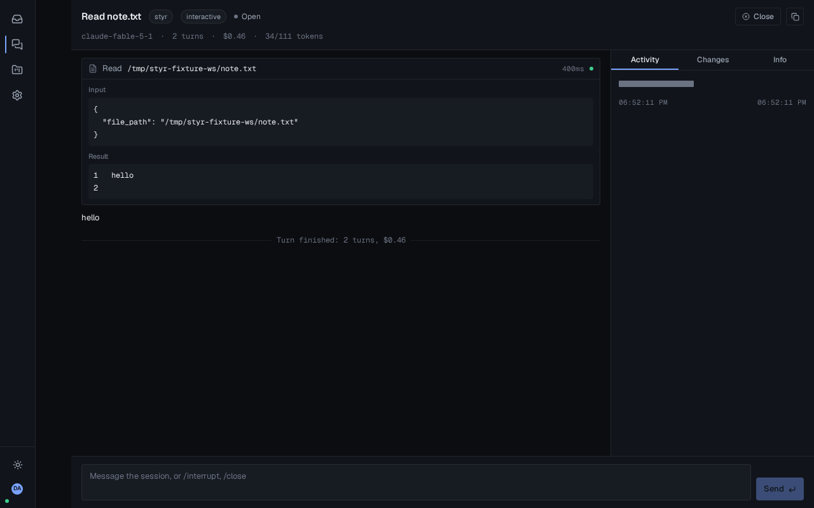
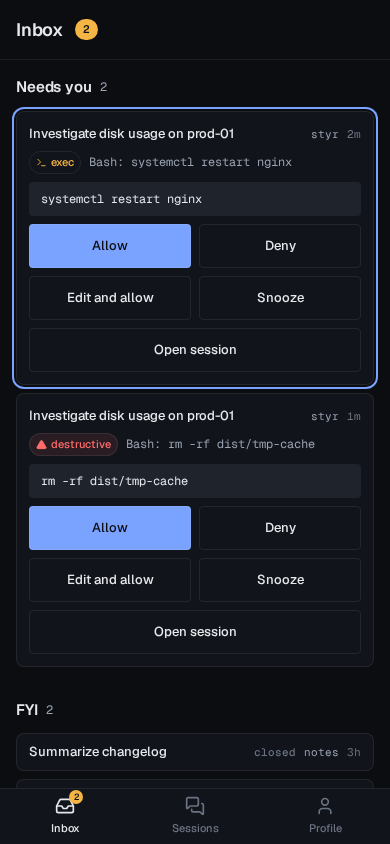

# Styr

Styr runs your Claude Code agents: start them from a browser, watch what they do, approve what
matters from your phone, and keep every decision on your own box.



## Why Styr

- **Your plan, not API credits.** Styr drives the Claude Code CLI with a `claude setup-token`
  OAuth token, so sessions bill your existing Max plan instead of metered API usage.
- **Real permission prompts, on your phone.** Every tool call still goes through Claude Code's
  own permission system; Styr just routes the prompt to your inbox instead of a terminal you
  have to be sitting at.
- **Private sessions per user.** Each person logs in with their own identity and their own
  Claude token; members see only their own sessions, admins see everything.
- **One binary.** Go backend, embedded React SPA, SQLite — `styr serve` and you're running, or
  use the Docker image.



## Quick start

Styr is early: v0.1.0 is the first release, and it covers login, sessions and approvals — see
[Features](#features) below for what's in and what's still to come.

### Install script (bare host, systemd)

```bash
curl -fsSL https://github.com/jonasthim/styr/releases/latest/download/install.sh | sudo bash
```

Then edit `/etc/styr/config.yaml` (set `base_url` and an OIDC provider) and
`systemctl restart styr`. See `deploy/README.md` for the full walkthrough, upgrades and
`install.sh --check`/`--uninstall`.

### Docker

```bash
cp deploy/compose.yaml .
cp deploy/config.example.yaml config.yaml   # edit base_url and oidc
docker compose -f compose.yaml up -d
```

### First login

Open `base_url` in a browser and sign in with your OIDC provider — the first user to log in
becomes admin. Then, on any machine where you're already logged into Claude, run
`claude setup-token` and paste the token into your Styr profile; each user brings their own
token, so their sessions bill their own plan. See [docs/OIDC.md](docs/OIDC.md) for provider
setup (Authentik, Authelia, Pocket ID, Keycloak).

## Features

v0.1 "Cockpit":

- OIDC login (PKCE) with per-user profiles; first user becomes admin
- Sessions list and a session view with tool-call blocks and an activity timeline
- Inbox with approvals: allow, deny or edit-then-allow a pending permission prompt from your
  phone
- Workspaces and profiles
- Command palette (`Cmd+K`) and full keyboard shortcuts
- Install script and Docker image, zero telemetry

### Roadmap

| Release | Contents |
|---|---|
| v0.1 Cockpit | OIDC login and profiles, sessions, session view with blocks and activity timeline, inbox with approvals, workspaces, profiles, palette and shortcuts, install script, Docker image, docs |
| v0.2 Review | Worktree per session, diff view, inline comments as prompts, commit and PR, plan approval checklist |
| v0.3 Triggers | Templates, inbound webhooks (generic, Grafana, GitHub), runs and reports, dedupe, cooldown, outbound ntfy and webhook, personal API tokens |
| v0.4 Schedules and loops | Cron, until-done loops, fleet Gantt, cost dashboard |
| v0.5 Pipelines | YAML DAG, live graph, fan-out, retries |
| v1.0 | Second harness (Codex CLI), stable API |

## Configuration

Every `config.yaml` key, its `STYR_*` environment override, tokens and the data directory
layout are documented in [docs/CONFIGURATION.md](docs/CONFIGURATION.md).

## Security model

Styr never bypasses Claude Code's own permission system — every tool call still goes through
the same prompts you'd see at a terminal, just routed to the inbox instead. Claude tokens are
encrypted at rest with a server-side key and are never returned by the API, only their status
and a short label. Sessions are private to their owner by default; only admins and unattended
runs are visible more broadly. See [SECURITY.md](SECURITY.md) to report a vulnerability.

## Contributing

See [CONTRIBUTING.md](CONTRIBUTING.md) for dev setup, the test suite and how work is organised
into task cards. Please also read [CODE_OF_CONDUCT.md](CODE_OF_CONDUCT.md).

## License

MIT — see [LICENSE](LICENSE).
