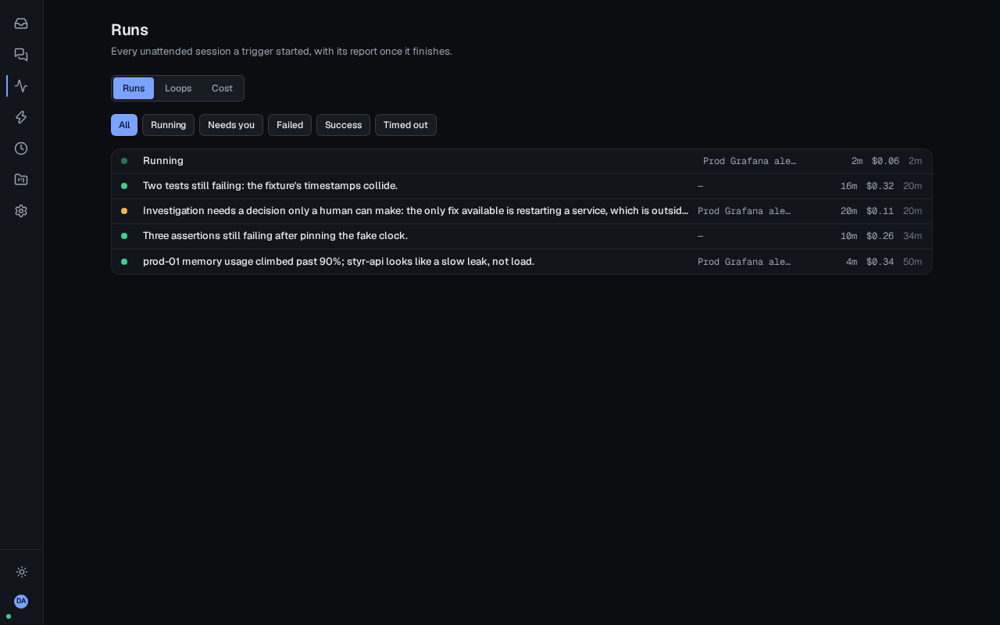
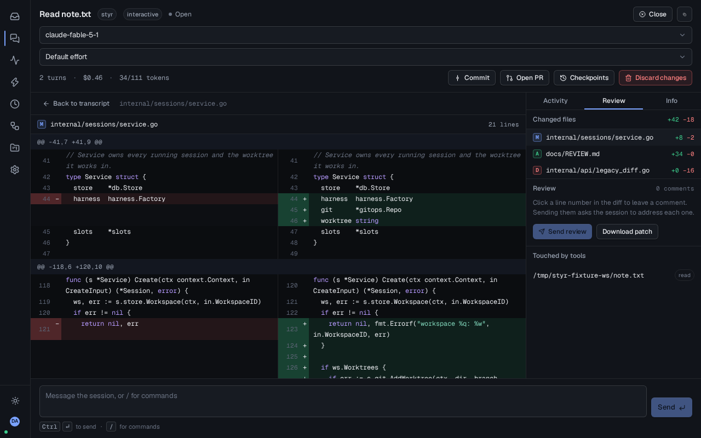
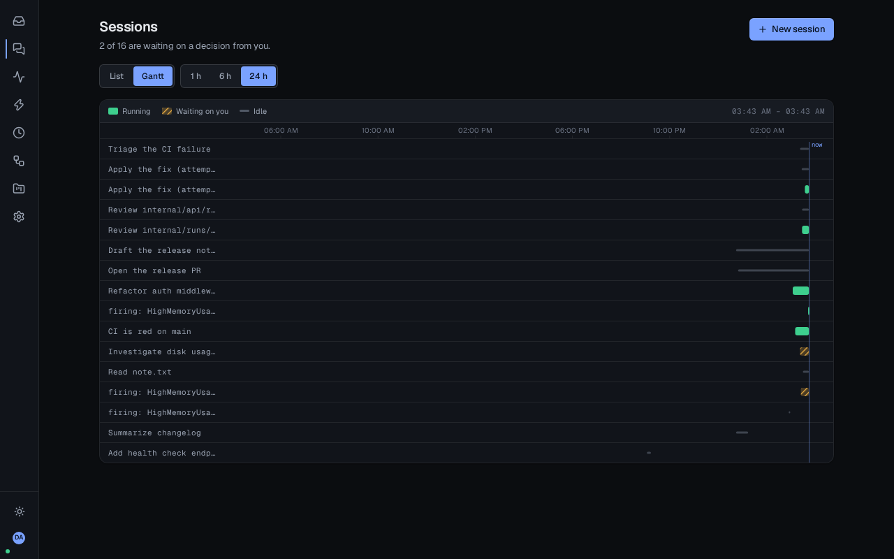
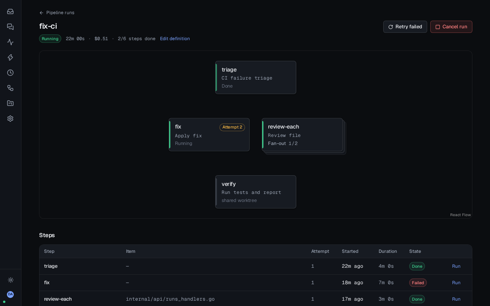

# Styr

Styr runs your Claude Code agents: start them from a browser, watch what they do, approve what
matters from your phone, and keep every decision on your own box.


## Status

What's proven: the real backend — the full stack, driving the fake Claude CLI rather than the
mocked frontend — is exercised end to end by the `real-desktop`/`real-phone` Playwright suite
(see [CONTRIBUTING.md](CONTRIBUTING.md)) before every release, and Styr runs as the author's own
homelab deployment, the audience it's built for. What isn't: there are no external users yet, and
the API and UI should still be expected to move before v1.0 — see the [Roadmap](#roadmap) below
for what's shipped and what's left.

## Why Styr

- **Your plan, not API credits.** Styr drives the Claude Code CLI with a `claude setup-token`
  OAuth token, so sessions bill your existing Max plan instead of metered API usage.
- **Real permission prompts, on your phone.** Every tool call still goes through Claude Code's
  own permission system; Styr just routes the prompt to your inbox instead of a terminal you
  have to be sitting at.
- **Private sessions per user.** Each person logs in with their own identity and their own
  Claude token; members see only their own sessions, admins see everything.
- **One binary.** Go backend, embedded React SPA, SQLite — `styr serve` and you're running, or
  use the Docker image.


## Quick start

Styr is early: v0.5.0 is the latest release, and it covers login, sessions, approvals, triggers,
runs and unattended investigations, review — worktrees, diffs, checkpoints, commit and PR —
schedules and loops — cron-driven runs, until-done loops, a fleet Gantt and a cost dashboard —
and now pipelines — YAML DAGs of chained agents, with fan-out, retries and shared worktrees — see
[Features](#features) below for what's in and what's still to come.

### Install script (bare host, systemd)

```bash
curl -fsSL https://github.com/jonasthim/styr/releases/latest/download/install.sh | sudo bash -s -- --listen 0.0.0.0:8080
```

Then edit `/etc/styr/config.yaml` (set `base_url` and an OIDC provider) and
`systemctl restart styr`. See `deploy/README.md` for the full walkthrough, upgrades and
`install.sh --check`/`--uninstall`.

### Docker

```bash
cp deploy/compose.yaml .
cp deploy/config.example.yaml config.yaml   # edit base_url and oidc
docker compose -f compose.yaml up -d
```

### First login

Open `base_url` in a browser and sign in with your OIDC provider — the first user to log in
becomes admin. Then, on any machine where you're already logged into Claude, run
`claude setup-token` and paste the token into your Styr profile; each user brings their own
token, so their sessions bill their own plan. See [docs/OIDC.md](docs/OIDC.md) for provider
setup (Authentik, Authelia, Pocket ID, Keycloak).

## Features



v0.1 "Cockpit":

- OIDC login (PKCE) with per-user profiles; first user becomes admin
- Sessions list and a session view with tool-call blocks and an activity timeline
- Inbox with approvals: allow, deny or edit-then-allow a pending permission prompt from your
  phone
- Workspaces and profiles
- Command palette (`Cmd+K`) and full keyboard shortcuts
- Install script and Docker image, zero telemetry

v0.2 "Triggers":

- Triggers and inbound webhooks (generic, Grafana, GitHub), with dedupe, cooldown and a storm cap
- Grafana alert investigation, seeded and ready to point a contact point at
- Runs and reports: every unattended investigation, its structured report and its cost, on a
  Runs page anyone can see
- ntfy and generic-webhook notifications when a run finishes, needs a human or fails
- Per-user managed workspaces, cloned or created on demand instead of only admin-registered paths
- Personal API tokens for scripting against the API without a browser session
- Per-session model and reasoning effort, switchable mid-session
- Slash-command menu in the composer, fed by the CLI's own commands and skills

See [docs/TRIGGERS.md](docs/TRIGGERS.md) for the full trigger, run and notification setup guide.

v0.3 "Review":



- Worktree per session on a worktree-enabled workspace: sessions run on their own branch,
  never in the workspace's shared checkout
- Diff review with inline comments that become the session's next prompt when you send the
  review
- Commit (folds the session's checkpoints into one commit) and Open PR (push plus `gh pr
  create`) straight from the session view
- Checkpoints after every turn, with rewind to any of them — files only, the chat is kept
- Plan approval: a plan-mode session's finished plan renders as a checklist you approve or send
  back with comments

See [docs/REVIEW.md](docs/REVIEW.md) for the full worktree, review, checkpoint and plan-approval
guide.

v0.4 "Schedules and loops":



- Cron schedules that start a template run on a cadence, with overlap protection: a schedule
  never runs two of its own instances concurrently, skipping (and logging) a tick instead
- Until-done loops: a template repeats its run on the same session until its structured report
  says it's done, or its iteration budget runs out
- Fleet Gantt: one lane per active session, running/waiting/idle over the last 1h/6h/24h
- Cost dashboard: what the whole box has spent, per day, per user and per origin, and the top
  templates by spend

See [docs/SCHEDULES.md](docs/SCHEDULES.md) for the full schedule, loop, Gantt and cost guide.

v0.5 "Pipelines":



- YAML DAG pipelines: a small chain of steps, each one a template run whose structured report
  feeds the steps after it
- Fan-out: a step's `foreach` over a list becomes N parallel step-runs, one per item
- Retries: a failed step gets a fresh attempt within its own budget before the failure cascades
- Shared worktrees: a step can continue in a dependency's own worktree instead of a fresh one, so
  a triage → fix → verify chain edits and tests the same checkout
- Live graph: the pipeline run page shows every step's state, attempt and report as it happens
- Start from a trigger or a schedule, not just by hand — a webhook or a cron cadence can fire a
  whole pipeline instead of a single template run

See [docs/PIPELINES.md](docs/PIPELINES.md) for the full YAML format, execution semantics and
worktree modes.

### Roadmap

| Release | Contents |
|---|---|
| v0.1 Cockpit | OIDC login and profiles, sessions, session view with blocks and activity timeline, inbox with approvals, workspaces, profiles, palette and shortcuts, install script, Docker image, docs |
| v0.2 Triggers (shipped) | Templates, inbound webhooks (generic, Grafana, GitHub), runs and reports, dedupe, cooldown, outbound ntfy and webhook, personal API tokens, per-session model and effort, slash-command menu |
| v0.3 Review (shipped) | Worktree per session, diff view, inline comments as prompts, commit and PR, checkpoints with rewind, plan approval checklist |
| v0.4 Schedules and loops (shipped) | Cron, until-done loops, fleet Gantt, cost dashboard |
| v0.5 Pipelines (shipped) | YAML DAG, fan-out, retries, shared worktrees, live graph, start from triggers and schedules |
| v1.0 | Second harness (Codex CLI), stable API |

## Configuration

Every `config.yaml` key, its `STYR_*` environment override, tokens and the data directory
layout are documented in [docs/CONFIGURATION.md](docs/CONFIGURATION.md). For backup, restore,
upgrading/downgrading and orphan worktree cleanup, see [docs/OPERATIONS.md](docs/OPERATIONS.md).

## Security model

Styr never bypasses Claude Code's own permission system — every tool call still goes through
the same prompts you'd see at a terminal, just routed to the inbox instead. Claude tokens are
encrypted at rest with a server-side key and are never returned by the API, only their status
and a short label. Sessions are private to their owner by default; only admins and unattended
runs are visible more broadly. See [SECURITY.md](SECURITY.md) to report a vulnerability.

## Contributing

See [CONTRIBUTING.md](CONTRIBUTING.md) for dev setup, the test suite and how work is organised
into task cards. Please also read [CODE_OF_CONDUCT.md](CODE_OF_CONDUCT.md).

## License

MIT — see [LICENSE](LICENSE).
